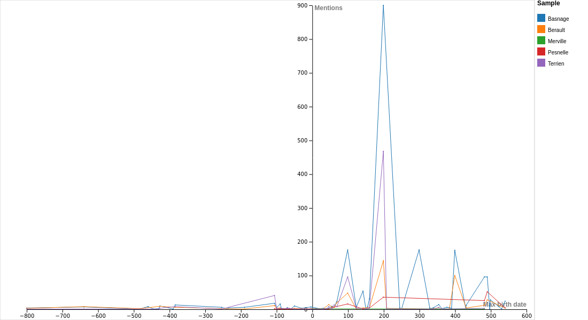
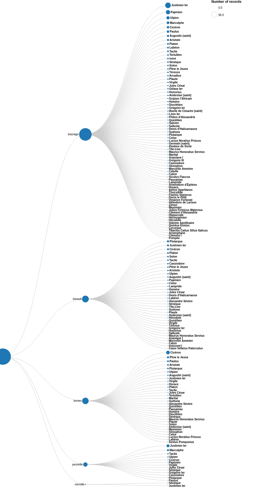
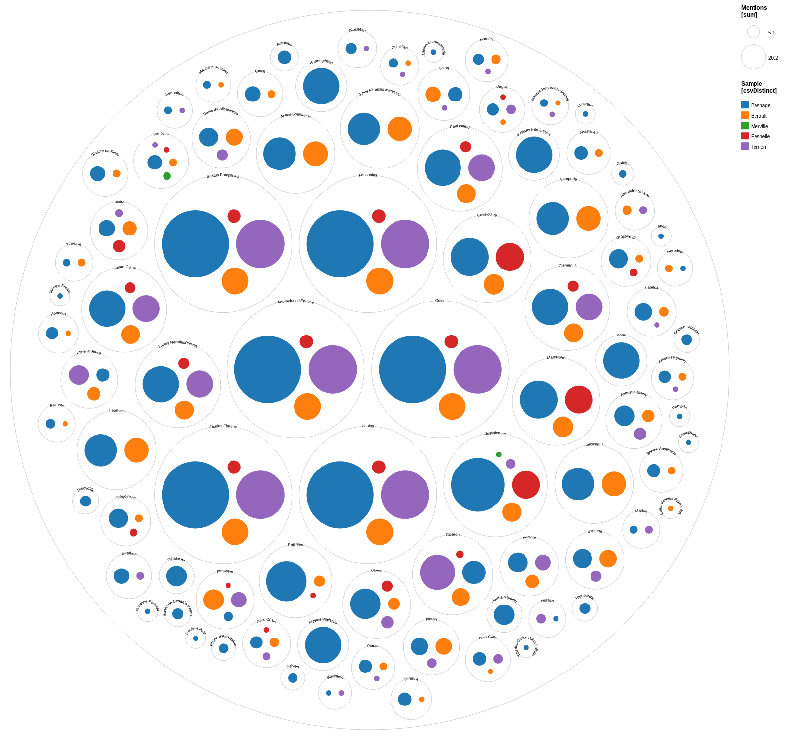

# classical-refs-in-ConDE-corpus
Material for an [article proposal](https://rmblf.be/2022/02/04/appel-a-contribution-lire-les-classiques-en-normandie/)

This repository will host the queries and their results for a study on the classical readings of Norman customary law commentators, as observable within the [ConDÉ corpus](https://github.com/RIN-ConDE/editions).
This README file will be updated as I work.

### Scripts:

* The main Python script is [extraction-classification.ipynb](extraction-classification.ipynb). It is still in progress. It aims to extract the entity information on relevant authors from the ConDÉ corpus, as well as information on the passages where they are mentionned. Output should be a CSV file.
* The next Python script is [dataviz.ipynb](dataviz.ipynb). It is meant to produce dataviz images. Not operational.

### Main CSV files:
* [authors.csv](authors.csv) contains a table with the information on each author.
* [mentions.csv](mentions.csv) contains an entry for each mention within targetted time-span (born before yead 550), with identification for the witness, part, chapter and section which contains it and, of course, the identity of the author mentionned there. Therefore, if an author is mentionned several times within each section, the table will contain multiple entries with the exact same information.
* [ for author timeline visualization, with 1-3 entries per author, according to whether dates are fixed or a time span

### Work files:

* [checklist.xml](checklist.xml) contains a copy of all TEI-XML author declaration without a date, classified by witness provenance, for debugging purposes. This is not a working XML file and only aims at allowing me to understand problems.
* [Rtable_author-chapter.csv](Rtable_author-chapter.csv) contains the output of a `table(mentions$Author, mentions$Chapter)` function in R, executed on *mentions.csv*.
* [Rtable_author-part.csv](Rtable_author-part.csv) contains the output of a `table(mentions$Author, mentions$Part)` function in R, executed on *mentions.csv*.
* [Rtable_birthdate-witness.csv](Rtable_birthdate-witness.csv) contains the output of a `table(mentions$'Birth start', mentions$Witness)` function in R, executed on *mentions.csv*.
* [Rtable_witness-part.csv](Rtable_witness-part.csv) contains the output of a `table(mentions$Witness, mentions$part)` function in R, executed on *mentions.csv*.
* [authors-birthdate-witness_joined-dataiku.csv](authors-birthdate-witness_joined-dataiku.csv) contains the results of the *Rtable_birthdate-witness.csv* file, to which the names of authors was added with the [Dataiku](https://www.dataiku.com/) join functions.
* [authors-birthdate-witness_for-timeline.csv](authors-birthdate-witness_for-timeline.csv) contains the previous file, transformed to fit dataviz needs with Python terminal commands as visible in [screencapture](Capture d’écran de 2022-03-18 14-23-59.png).

### Initial data visualisation:

Dates of authors mentionned within the corpus:

(Provenance : [RawGraphs](https://rawgraphs.io/), Gantt chart, with [authors.csv file](authors.csv).)

Witnesses linked with authors:

(Provenance : [Palladio](https://hdlab.stanford.edu/palladio), Graph, with [mentions.csv file](mentions.csv))

Timeline of mentionned authors, witness by witness:

(Provenance: [RawGraphs](https://rawgraphs.io/), Line chart, with [authors-birthdate-witness_for-timeline.csv file](authors-birthdate-witness_for-timeline.csv))

Authors by witness:

(Provenance : [RawGraphs](https://rawgraphs.io/), Linear dendogram, with [mentions.csv file](mentions.csv).)
Warning: the rendering is not final because of the absurd format necessary for the image to be readable.

Authors within witness structure:

(Provenance : [RawGraphs](https://rawgraphs.io/), Linear dendogram, with [mentions.csv file](mentions.csv).)
Warning: the rendering is not final because of the absurd format necessary for the image to be readable, as well as because this does not give us information about topics within each portion of text.

How witnesses are dispatched for each author:

(Provenance : [RawGraphs](https://rawgraphs.io/), Circle packing, with [authors-birthdate-witness_for-timeline.csv](authors-birthdate-witness_for-timeline.csv).)