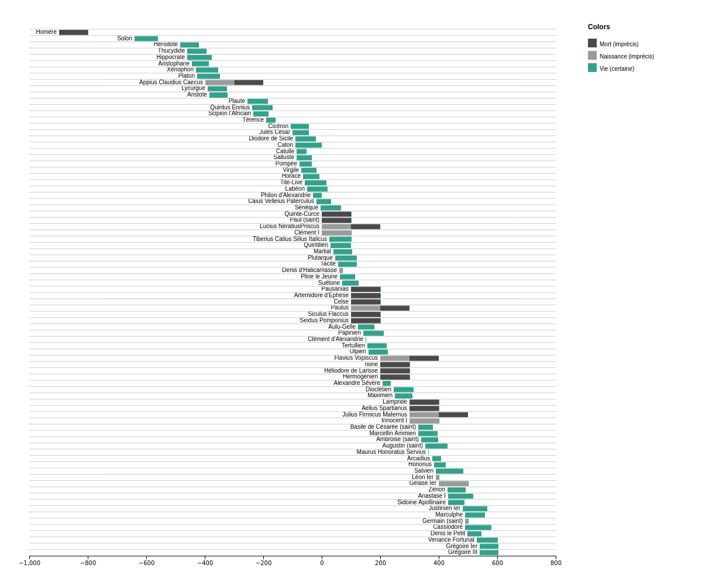
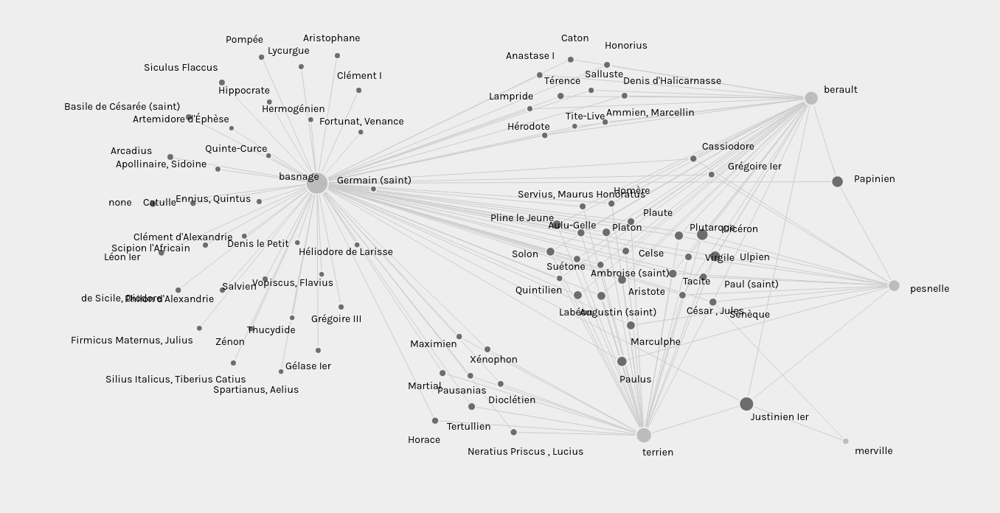
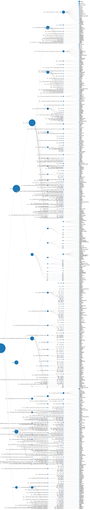

# classical-refs-in-ConDE-corpus
Material for an [article proposal](https://rmblf.be/2022/02/04/appel-a-contribution-lire-les-classiques-en-normandie/)

This repository will host the queries and their results for a study on the classical readings of Norman customary law commentators, as observable within the [ConDÉ corpus](https://github.com/RIN-ConDE/editions).
This README file will be updated as I work.

### Scripts:

* The main Python script is extraction-classification.ipynb. It is still in progress. It aims to extract the entity information on relevant authors from the ConDÉ corpus, as well as information on the passages where they are mentionned. Output should be a CSV file.
* *Later work includes analyzing those results and producing data visualization. Whether this will be a separate script or within the first is yet unknown.*

### Work files:

* checklist.xml contains a copy of all TEI-XML author declaration without a date, classified by witness provenance, for debugging purposes. This is not a working XML file and only aims at allowing me to understand problems.
* mentions.csv contains an entry for each mention within targetted time-span (born before yead 550), with identification for the witness, part, chapter and section which contains it and, of course, the identity of the author mentionned there. Therefore, if an author is mentionned several times within each section, the table will contain multiple entries with the exact same information.

### Initial data visualisation:

Dates of authors mentionned within the corpus:

(Provenance : [RawGraphs](https://rawgraphs.io/), Gantt chart, with [mentions.csv file](mentions.csv).)

Witnesses linked with authors:

(Provenance : [Palladio](https://hdlab.stanford.edu/palladio), Graph, with [mentions.csv file](mentions.csv))

Authors within witness structure:

(Provenance : [RawGraphs](https://rawgraphs.io/), Linear dendogram.)
Warning: the rendering is not final because of the absurd format necessary for the image to be readable, as well as because this does not give us information about topics within each portion of text.
