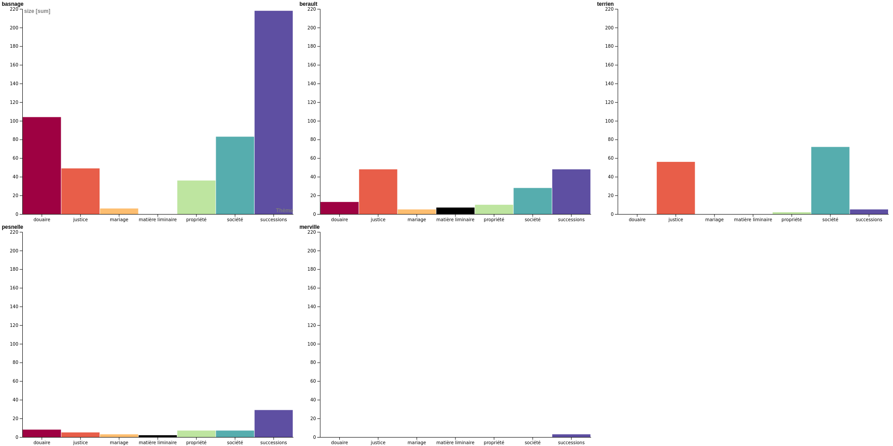

# "Classic" references within the ConDÉ corpus: tools and results
Material for a [paper](https://www.fabula.org/actualites/109702/lire-les-classiques-en-normandie.html) communicated on 6. October 2022 in Rouen ([call](https://rmblf.be/2022/02/04/appel-a-contribution-lire-les-classiques-en-normandie/))

The slides are available as a [PDF file](2022-10-06_rouen_classiques-normandie.pdf).

This repository hosts the queries and their results for a study on the classical readings of Norman customary law commentators, as observable within the [ConDÉ corpus](https://github.com/RIN-ConDE/editions). Once all material is ready, this repository will not be updated again.

Please be advised that this work will by no means be appliable to any TEI-XML corpus, as it is specifically designed for the ConDÉ corpus, with no intention of being generalisable. Please also note that, if it is useful to you, it will be available under Creative Commons licence (CC-BY) by mid-october. You are welcome to use, fork and modify, as long as you cite me as the original author.

Current documentation is available below the "Final data visualisation" section.

## Final data visualization:

Documentation is within the [dataviz](dataviz) folder.

#### The proportion of "classical" references in each work

#### How rich each work is in "classical" references, given its number of tokens

#### How authors are distributed on a timeline

#### How much is each author mentionned across the corpus

#### How much is each author mentionned, by work

#### How much each work mobilizes time periods

#### How many times "classical" authors are mentionned in each main theme

#### How much each work mentions "classical" authors, in each main theme

#### The authors frequently mentionned in the same section of text

### Update note:
2022-09-29 : All scripts complete, all output done. Dataviz done outside of scripts, for lack of time, via [RawGraphs](https://www.rawgraphs.io/). The latest scripts are not yet documented.

## Scripts:

* All scripts were originally executed using Python 3.9.7.
* The main Python script is [sort_and_extract.ipynb](sort_and_extract.ipynb) extracts the entity information on relevant authors from the ConDÉ corpus, connects them with their IdRef entity when possible, and extracts all mentions within the corpus as left-hand context, mention, right-hand context and precise origin information (part > chapter > section titles). Its outputs are written within a folder bearing a minute time stamp. They are: a general author CSV table, its equivalent in Json, the relevant author CSV table, an occurrence output report and one CSV table per author, containing every extracted information.

The next and Python scripts exploit the general output of the first.

* The first is [dataviz.ipynb](dataviz.ipynb). It uses the Pandas library to revise the large CSV table into more or less precise tables, which may then be used to create graphs on RawGraphs, according to the level of generality needed.
* The second is [get-percentages.ipynb](get-percentages.ipynb), which goes back to the XML files and produces [the output CSV table](dataviz/2022-09-28/tableau-recap.csv) in the dataviz folder, comparing the total of references in each work to the total of classical references.
* The third is [deduce-theme.ipynb](deduce-theme.ipynb), which uses regular expressions on key words to separate all text sections into seven main themes. The themes are informal and only meant to give an idea to a non specialist of the distribution, given the large number of sections in the table, making them difficult to represent in a graph.
* The third is [cooccurrences.ipynb](cooccurrences.ipynb), which uses the revised output from the deduce-theme script, to deduce couples of authors mentionned in the same section, along with the according theme. It keeps only couples with at least three common mentions in the same theme.
